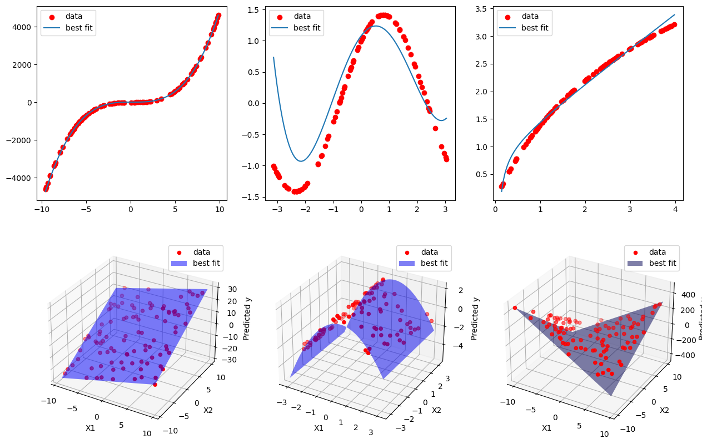

# TinyGP in C

[TinyGP by Riccardo Poli](https://github.com/JesseBuesking/TinyGP-Java) rewritten in C with Python bindings.

TinyGP performs symbolic regression using genetic programming. It evolves a population of algebraic formulas to fit a dataset:



- A C library implementing TinyGP: [`tiny_gp.c`](tiny_gp.c) and [`tiny_gp.h`](tiny_gp.h)
- A command-line interface for TinyGP in C: [`tiny_gp_cli.c`](tiny_gp_cli.c)
- Similar CLI in Python: [`tiny_gp_cli.py`](tiny_gp_cli.py)
- Python wrappers and notebooks for using TinyGP:
  - [`tiny_gp.py`](tiny_gp.py)
  - [`tiny_gp_1.ipynb`](tiny_gp_1.ipynb)
  - [`tiny_gp_2.ipynb`](tiny_gp_2.ipynb)
- Data files for experiments: [`BTC-Daily.csv`](BTC-Daily.csv)

## C API

```c
tgp_state *tgp = tgp_init(
	"problem.dat",
	POP_SIZE,
	PROG_SIZE,
	CMD_MUTATION_PROB,
	CROSS_VS_MUT_PROB,
	TOURNAMENT_SIZE,
	SEED
);

if (!tgp) {
	printf("Failed to load the problem\n");
	return 1;
}

for (int i = 0; i < 100; i++) {
	tgp_evolve(tgp);

	double best_fit = tgp_fitness(tgp, tgp_best(tgp));
	if (best_fit > -1e-6) {
		break;
	}
}

char str[4096];
tgp_str(tgp, tgp_best(tgp), 2, str, 4096);
printf("%s\n", str);

tgp_free(tgp);
```

# Python API

```py
try:
	tgp = TinyGP(
		"problem.dat",
		POP_SIZE,
		PROG_SIZE,
		CMD_MUTATION_PROB,
		CROSS_VS_MUT_PROB,
		TOURNAMENT_SIZE,
		SEED,
	)
except Exception as e:
	print(e)
	return

for i in range(100):
	tgp.evolve()

	best_fit = tgp.fitness(tgp.best())
	if best_fit > -1e-6:
		break

print(tgp.str(tgp.best(), 2))
```

## Prerequisites

- A fairly recent C compiler with CMake.
- Python 3 with NumPy, Matplotlib, and Pandas for the Jupyter notebooks.

## Installation

Build the C library and the CLI:

```sh
mkdir build
cd build
cmake ..
cmake --build .
cd ..
```

This will compile `tiny_gp` libraries and the `tiny_gp_cli` executable.

## Usage

### Running the CLI

```sh
./build/tiny_gp_cli 42 problem.dat
# Here 42 is a random seed for the algorithm.
```

The same CLI was implemented in Python using the bindings from [`tiny_gp.py`](tiny_gp.py):

```sh
python tiny_gp_cli.py 42 problem.dat
```

### Jupyter Notebooks with Experiments

Python bindings allow TinyGP to be used in Jupyter notebooks for easy data analysis and visualization.

Here's some examples:

- [`tiny_gp_1.ipynb`](tiny_gp_1.ipynb): First set of tasks, includes symbolic regression of different functions. Uses a limited set of functions without `sin(x)` and `cos(x)`.
- [`tiny_gp_2.ipynb`](tiny_gp_2.ipynb): Advanced experiments, includes symbolic regression with trigonometric functions and modeling [real-world Bitcoin price data, `BTC-Daily.csv`](BTC-Daily.csv).

## Project Structure

- [`tiny_gp.c`](tiny_gp.c): Re-implementation of TinyGP in C.
- [`tiny_gp.h`](tiny_gp.h): Header file with the public API.
- [`tiny_gp_cli.c`](tiny_gp_cli.c): Command-line interface for TinyGP.
- [`tiny_gp.py`](tiny_gp.py): Python bindings for TinyGP.
- [`tiny_gp_cli.py`](tiny_gp_cli.py): The same CLI, but realized in Python using the bindings.
- [`tiny_gp_1.ipynb`](tiny_gp_1.ipynb): Jupyter notebook with the first set of tasks.
- [`tiny_gp_2.ipynb`](tiny_gp_2.ipynb): Jupyter notebook with a second set of tasks.

## License

This project is licensed under the MIT License - see the [LICENSE](LICENSE) file for details.

The original TinyGP implementation was created Riccardo Poli - no license, assume all rights reserved.
